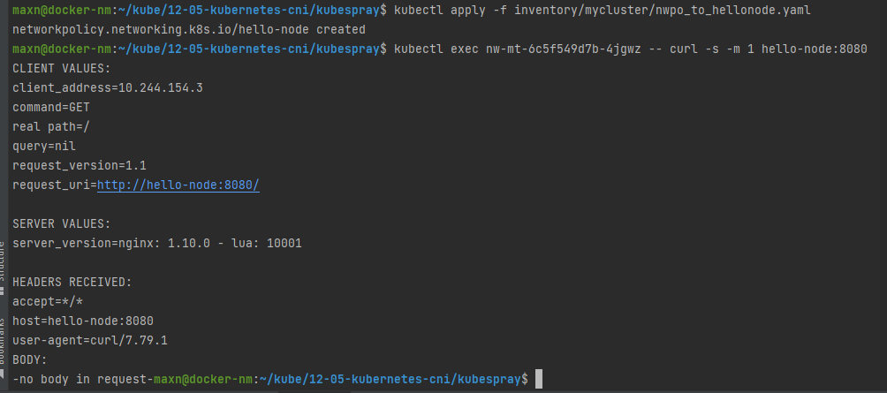

# 12-05-kubernetes-cli

##1 Сетевые политики

Без сетевых политик


Закрыли доступ дефолтной политикой


Дали доступ network-multitool к нодам hello-node





Ко второму сервису доступа нет, т.к. в политиках не прописан


##2 Calicoctl

Рабочая нода одна для экономии денег на облаке
```shell
maxn@docker-nm:/usr/local/bin$ calicoctl get node
NAME    
cp1     
node1   

maxn@docker-nm:/usr/local/bin$ calicoctl get ippool
NAME           CIDR            SELECTOR   
default-pool   10.244.0.0/16   all()      

maxn@docker-nm:/usr/local/bin$ calicoctl get profile
NAME                                                 
projectcalico-default-allow                          
kns.default                                          
kns.ingress-nginx                                    
kns.kube-node-lease                                  
kns.kube-public                                      
kns.kube-system                                      
ksa.default.default                                  
ksa.ingress-nginx.default                            
ksa.ingress-nginx.ingress-nginx                      
ksa.kube-node-lease.default                          
ksa.kube-public.default                              
ksa.kube-system.attachdetach-controller              
ksa.kube-system.bootstrap-signer                     
ksa.kube-system.calico-kube-controllers              
ksa.kube-system.calico-node                          
ksa.kube-system.certificate-controller               
ksa.kube-system.clusterrole-aggregation-controller   
ksa.kube-system.coredns                              
ksa.kube-system.cronjob-controller                   
ksa.kube-system.daemon-set-controller                
ksa.kube-system.default                              
ksa.kube-system.deployment-controller                
ksa.kube-system.disruption-controller                
ksa.kube-system.dns-autoscaler                       
ksa.kube-system.endpoint-controller                  
ksa.kube-system.endpointslice-controller             
ksa.kube-system.endpointslicemirroring-controller    
ksa.kube-system.ephemeral-volume-controller          
ksa.kube-system.expand-controller                    
ksa.kube-system.generic-garbage-collector            
ksa.kube-system.horizontal-pod-autoscaler            
ksa.kube-system.job-controller                       
ksa.kube-system.kube-proxy                           
ksa.kube-system.namespace-controller                 
ksa.kube-system.node-controller                      
ksa.kube-system.nodelocaldns                         
ksa.kube-system.persistent-volume-binder             
ksa.kube-system.pod-garbage-collector                
ksa.kube-system.pv-protection-controller             
ksa.kube-system.pvc-protection-controller            
ksa.kube-system.replicaset-controller                
ksa.kube-system.replication-controller               
ksa.kube-system.resourcequota-controller             
ksa.kube-system.root-ca-cert-publisher               
ksa.kube-system.service-account-controller           
ksa.kube-system.service-controller                   
ksa.kube-system.statefulset-controller               
ksa.kube-system.token-cleaner                        
ksa.kube-system.ttl-after-finished-controller        
ksa.kube-system.ttl-controller                       

```